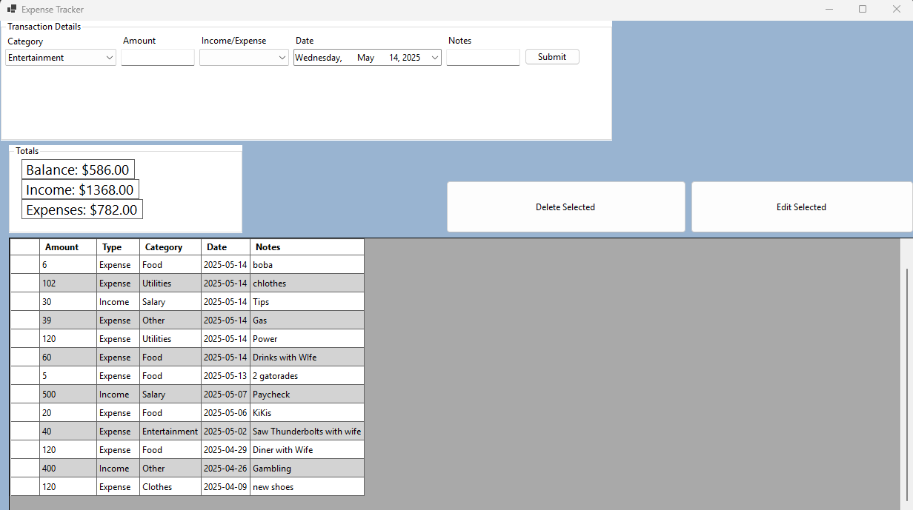
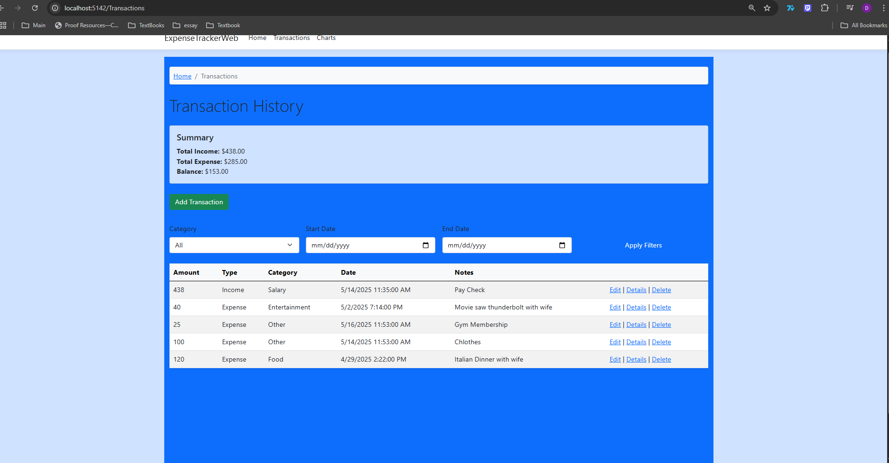
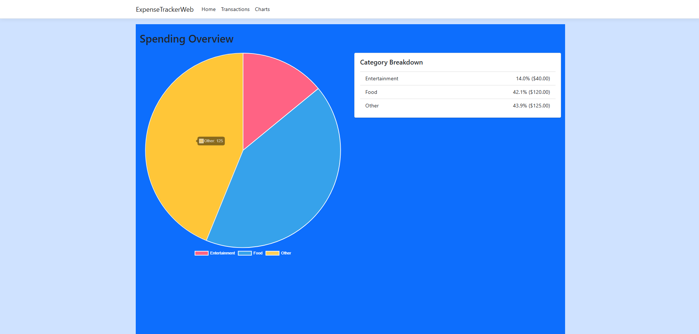

# Expense Tracker – C# WinForms + ASP.NET Core Razor Pages + SQLite 

A full-featured personal expense tracker built as both a **desktop application** and a **web application**. Designed for intuitive transaction tracking, real-time summaries, and visual breakdowns of spending using charts. Both versions use a shared **SQLite** database for local data persistence.

---

## Desktop App – C# WinForms + SQLite

A Windows desktop application built using **C# WinForms**, featuring live summaries, inline editing, and visualizations using built-in charting tools.

---



## Features

### Transaction Management
- Add income or expense transactions
- Assign categories and add notes
- Select transaction date
- Edit or delete any existing transaction

### Category Support
- Pre-seeded categories:
  - `Food`, `Rent`, `Salary`, `Entertainment`, `Utilities`, `Clothes`, `Other`
- "Refresh Categories" button to reload dropdowns after edits

### Data Grid
- View all transactions in a sortable grid
- Columns: Amount, Type, Category, Date, Notes
- Built-in summary of total income, expenses, and balance

### Local Database
- Uses **SQLite** (`expenses.db`) stored in the project directory
- Tables:
  - `Categories`
  - `Transactions`
- Automatic table creation and seeding via `DatabaseInitializer`

---

## Project Structure

```
/ExpenseTrackerWinForms
├── Form1.cs                # Main UI logic
├── Form1.Designer.cs       # WinForms layout
├── DatabaseInitializer.cs  # SQLite setup & seeding
├── expenses.db             # Local SQLite database
├── Program.cs              # App entry point
```

---

## Getting Started

### Requirements
- Windows OS
- Visual Studio 2022+
- .NET 6 SDK

### How to Run

1. Clone the repository  
2. Open the solution `.sln` file in Visual Studio  
3. Set `expenses.db` to "Copy if newer"  
4. Press `F5` to run the application  

---

## Tech Stack

- C# WinForms (.NET 6)
- SQLite (`System.Data.SQLite`)
- System.Windows.Forms.DataVisualization.Charting

---

## Web App – ASP.NET Core Razor Pages + SQLite

A responsive web application built using **ASP.NET Core Razor Pages** with **Entity Framework Core**, styled with **Bootstrap**, and enhanced with **Chart.js** for visual insights.

---




## Features

### Web-Based Interface
- Responsive Bootstrap 5 layout
- View, filter, and manage transactions from any browser

### Filtering & Navigation
- Filter by **Category** and **Date Range**
- Breadcrumb navigation for improved UX

### Chart Visualization
- Pie chart of expenses by category (Chart.js)
- Textual breakdown of percentage and amounts per category
- Light blue theme styled to match desktop version

### Local Database
- Shared `expenses.db` file across apps
- Automatic EF Core table creation and querying

---

## Project Structure

```
/ExpenseTrackerWeb
└── /Pages/Transactions/
    ├── Index.cshtml     # View, filter, and summarize transactions
    ├── Create.cshtml    # Add new transaction
    ├── Edit.cshtml      # Edit existing transaction
    ├── Charts.cshtml    # Pie chart and breakdown visualization
```

---

## Getting Started

### Requirements
- Visual Studio 2022+
- .NET 8 SDK
- SQLite

### How to Run

1. Navigate to `/ExpenseTrackerWeb`  
2. Open in Visual Studio  
3. Run the application  
4. Visit `/Transactions` to view transactions  
5. Visit `/Transactions/Charts` to view category chart  

---

## Tech Stack

- ASP.NET Core Razor Pages (.NET 8)
- Entity Framework Core (EF Core)
- SQLite
- Chart.js
- Bootstrap 5

---

## Future Features (ongoing Project)

- [ ] Export to CSV (desktop & web)
- [ ] Monthly summary dashboard
- [ ] Dark mode toggle
- [ ] In-app category manager (web)
- [ ] Chart filters by custom date ranges
- [ ] Optional login system for web users

---

## Author

**Devin Grace**  
Versatile full-stack developer passionate about building practical desktop and web tools for real-life productivity.
